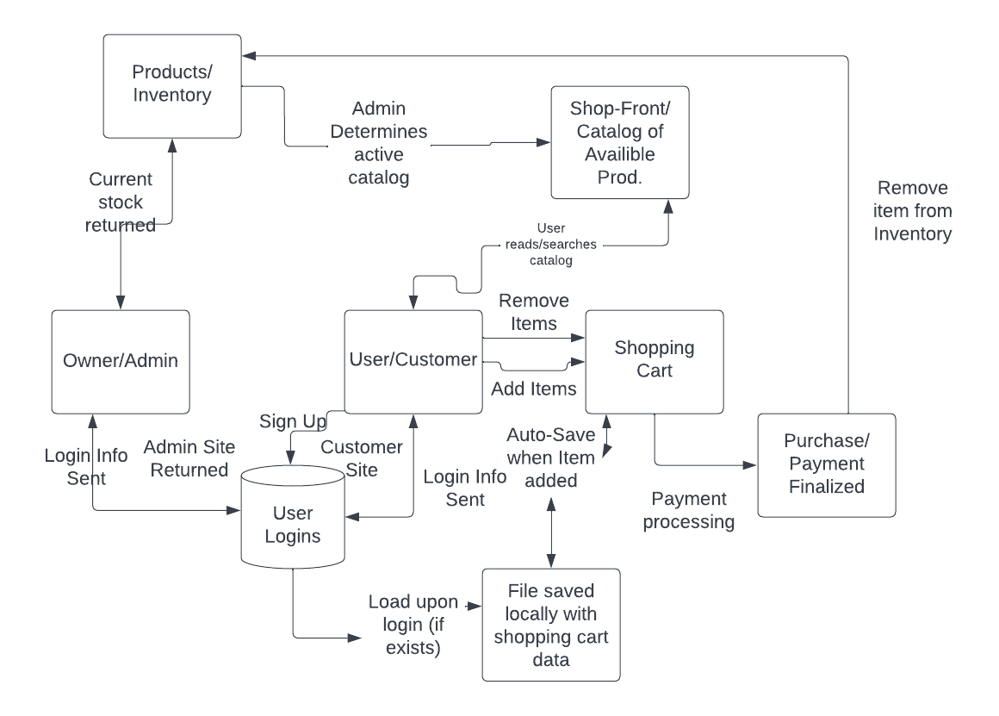
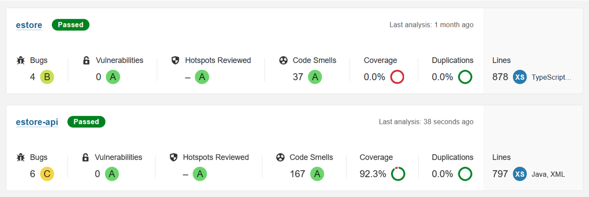

# PROJECT Design Documentation

## Team Information
* Team name: README
* Team members
  * John Skorcik
  * Paul Harrison
  * Hridiza Roy
  * Benson Haley
  * Kevin Park

## Executive Summary

* Our project is an e-commerce website, built using Angular, Typescript and Java. It manages an inventory of products, users and an admin. The users can add products to their shopping carts and buy them, and the admin can update the inventory.

### Purpose

* Our project's purpose is to facilitate transactions between product owners and customers through an e-store. Our most important user group is e-shoppers, and our user goals are to be able to purchase products online.

### Glossary and Acronyms

| Term | Definition             |
|------|------------------------|
|  UI  | User Interface         |
|  MVP | Minimum Viable Product |

## Requirements

This section describes the features of the application.

* Inventory Management - the Admin is able to add, edit and delete products
* Shopping Cart - A Customer is able to add and remove products in their shopping cart and save it for later
* Browse and Search - The Admin and Customers are able to browse and search products in the inventory

### Definition of MVP
* An e-store where the admin can login and update the inventory, and customers can sign up, login, browse and search products and add them to their shopping cart.

### MVP Features
* New User creation
* User Authentication
* Inventory Management
* Searching
* Shopping Cart Persistence

### Roadmap of Enhancements
* UI enhancements and optimizations
* Bidding on products when scarcity is detected to fuel liquidity

## Application Domain

This section describes the application domain.

* This application involves an interaction between the Customers, the Inventory and the Admin.
* Customers can sign up and login to the e-store
* Customers can add and remove items from their shopping cart
* Customers can access their previously saved shopping cart upon logging out and logging back in
* The Admin and Customers can browse and search for products
* The Admin can add, edit and remove products from the inventory

## Architecture and Design

This section describes the application architecture.

### Summary

The following Tiers/Layers model shows a high-level view of the webapp's architecture.

The e-store web application, is built using the Model–View–ViewModel (MVVM) architecture pattern. 

The Model stores the application data objects including any functionality to provide persistance. 

The View is the client-side SPA built with Angular utilizing HTML, CSS and TypeScript. The ViewModel provides RESTful APIs to the client (View) as well as any logic required to manipulate the data objects from the Model.

Both the ViewModel and Model are built using Java and Spring Framework. Details of the components within these tiers are supplied below.

### Overview of User Interface

This section describes the web interface flow; this is how the user views and interacts
with the e-store application.

* Home Page
  * Navigation bar
    * Home
    * Products
    * Cart (Logged in customers only)
    * Login/Sign up or Logout
* Products
  * Navigation bar
  * Search bar
  * Products list
  * Edit/Add/Delete Product (Admin only)
* Single Product
  * Product Name
  * Product Description
  * Product Images
  * Product Price
  * Add to cart button
* Cart (Logged in customers only)
  * Items in cart
    * Add/Delete item
    * Increase/decrease quantity
* Add Product to Inventory (Admin only)
  * Product Name
  * Product Description
  * Product Quantity
  * Product Price
* Login
  * Username
  * Password
* Sign up
  * First name
  * Last name
  * Username
  * Password

### View Tier

* The viewer starts at the Home page where they are shown a description of the e-store and a navigation bar that can lead them to products or the login/sign up page
* They can then login or sign up as a customer by going to the login/sign up page
* They can browse products by going to the products page
* They can search products by typing keywords into the search box
* They can click on a specific product to view it in detail and add it to cart
* They can go to the cart page to see the items in their cart and change the quantities or remove products

* The admin can login from the login/sign up page
* They can browse, search, and delete products from the products page
* They can edit a specific product by clicking on the "Edit Product" button
* They can add products from the Add Product page

* Admins and Customers can sign out

### Model Tier

* A Product has a name, description, price and quantity.
* A Cart is an object that stores an array of products. Products can be added and removed from the cart.
* A User has a username, password, and a cart. The cart of the user can be updated.
* The Inventory is shared amongst all users, and can be used by the admin to add, edit and delete products
* Registry can be used to find existing Users and create new Users.

## Static Code Analysis

Static code analysis is completely set up via SonarQube.  The information provided by the SonarQube service made it easy to adjust duplicate code and improve code standards in general.  It was also useful to see which parts of the code were covered by unit tests, which is explained in the following section.

One of the primary causes of code smells was our backend debugging logger, which used string concatenation instead of a StringBuilder class for ease of use.  Arguably, for efficiency, SonarQube was right that it should have been a StringBuilder, but for readability we prefered using simple string concatenation.  Additionally, SonarQube marked several public modifiers as unnecessary, which could have led to better code if the project had been continued for many more sprints, but these modifiers made fast prototyping of the site much easier.

On the frontend side, SonarQube reported some more string-related code smells, in that we invoked the power of Angular's string wrapper type when we could have used basic strings and saved in memory capacity by some small margin.  The rest of the code smells were generally very small, involving redundant comments and unused imports.

## Testing

### Acceptance Testing
Many user stories have both a back-end and front-end component.  For all of the user stories marked as completed, the back-end and front-end components are implemented.

### Unit Testing and Code Coverage
Our target for code coverage was to have at least 90% overall code coverage on instructions and branches, which was achieved.  The reason why we chose overall coverage instead of individual coverage was due to the anomoly of the main function not being listed as covered by testing, which is intuitively false given that it only calls fully tested Spring loading code, but unit testing a static function without being able to mock its internals makes unit testing the main function an impossibility.  The remaining components are mostly tested to 100% completion, but some are only partially tested, due to the volatile nature of their APIs.

Our total code coverage of 93% of instructions and 90% of branches accounts for testing of all the stable parts of the API without allowing for creation of obsolete testing code for the more volatile parts of the API.  More detailed statistics can be found within the coverage directory of the project, generated by JaCoCo.  

## Recommendations for Improvement

In further sprints, the project could have been easily expanded, especially due to the nature of our easily implementable basic DAO reflective class.  The easiest feature to add in future sprints would be to polish the UI, which could additionally be updated once the website was in production, with some of our team members allocated to dev-ops.  A production version of the site would also allow for fine-tuning of the bidding 10% feature.  

New features could also be added, like more fine-tuned controls for searching items, which currently only allow searching by name and not by any of the text in the description.  In general, descriptions could also be improved, as well as general details on the site for new users, like an explanation of the bidding system so users are not confused.

In terms of improvements based on the static analytics data, code improvements could be made primarily on the frontend by removing unneccessary imports.  Additionally, both the frontend and backend suffered from inefficient string implementations, for the product text and debug messages respectively.  Extremely efficient string implementations exist, but they would have to be researched to find the best implementation for our use-case.  In all likelihood, some variant of the Folly library's fbString would be beneficial to the application's runtime efficiency.

## Analysis of Design Principles

As previously mentioned, the backend was built around the DRY design principle.  This is why Java reflection was used to create a generic basic file DAO which could be implemented for users and products to create the registry and inventory respectively.  This design choice meant that there was not massive code duplication between the registry and inventory classes, and means that in the future, the application is much more extensible in case more file DAOs are necessary.

The backend also utilized the Single Responsibility Principle, which states that each component of the application should exist for one reason, and not extend into the territory of other components.  Each model was clearly split into its own class, and user-related code was housed only in the registry.  While this design principle did not directly change the outlook of the project, it means that, just like the last point, the application is much more extensible for future use.  Team members could join and leave and still understand the setup of the application because related code is kept in individual components and are not mixed between classes.

Lastly, the frontend follows the Law of Demeter, which states that individual components should not share unneccessary information with other components.  In pure JavaScript, the global Document Object Model (DOM) makes it impossible to satisfy the Law of Demeter, but by rarely querying the DOM and instead using Angular's typesafe systems, compartmentalization was achieved.  Apart from the navigation bar which is shared between all of the pages, which needs to hold plenty of information from other components to figure out how to react to user queries, every component only contains the least possible private information to function, ultimately decreasing code-bloat.
